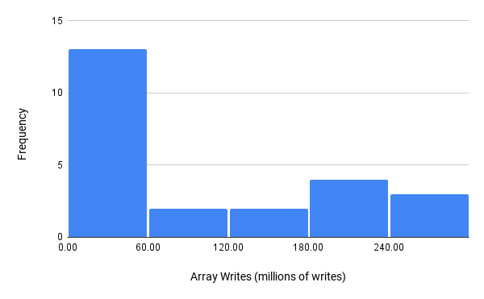
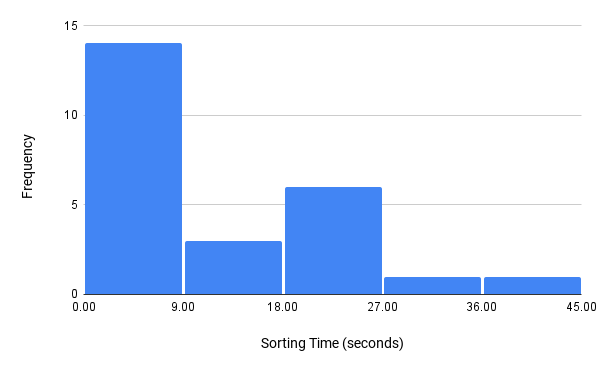

# Analysis of Sorting Algorithms

## **Objectives** 
Students rarely receive experience in the collection and analysis of data. Usually, the data used for analysis is given to the student. This project is meant to reverse that by having students collect and analyze their own data. Thus, the objective of this project is to provide students with data collection experience that is lacking in their usual coursework. Through this project, students will learn to use statistical software (such as Minitab, Excel, etc.) and write technical reports for industry use.

## **Data Description**
In computer science, one of the venerable challenges is sorting; Sorting is taking a set of data and rearranging it in order. For example, a set of numbers would be rearranged in increasing order. Innumerable solutions have been developed for sorting. In this technical report, 25 different sorting algorithms are benchmarked to determine how they perform on the same data set of 20,000 randomized integers from 0 to 100,000. The sorting algorithms were implemented using the Python programming language and executed with this collection of numbers.

The discrete data collected indexes every time a sorting algorithm writes to an array in memory. An array is a collection of multiple items (numbers, in this case), and the program tallies each time a sorting algorithm changes a value in the main array or an auxiliary array. 25 different sorting algorithms produced 25 pieces of discrete data detailing how many times each algorithm wrote to an array.

The continuous data were collected by timing each algorithm. For all 25 sorting algorithms, the algorithms were tasked with sorting the randomized list of numbers and the execution was timed. This produced 25 different times showing how fast each algorithm accomplished the task.

## **Data and Summary Statistics**
The number of array writes for each algorithm is shown in the table below:

| Sorting Algorithms              | Array Writes                 |
|---------------------------------|------------------------------|
| Insertion Sort                  | 101,231,069 Writes to Arrays |
| Binary Insertion Sort           | 101,231,134 Writes to Arrays |
| Merge Sort                      | 614,462 Writes to Arrays     |
| Iterative Merge Sort            | 293,578,096 Writes to Arrays |
| Selection Sort                  | 40,000 Writes to Arrays      |
| Quick Sort                      | 392,670 Writes to Arrays     |
| Iterative Quick Sort            | 293,578,096 Writes to Arrays |
| Gnome Sort                      | 202,422,140 Writes to Arrays |
| Heap Sort                       | 536,488 Writes to Arrays     |
| Shell Sort                      | 617,618 Writes to Arrays     |
| Bubble Sort                     | 202,422,140 Writes to Arrays |
| Comb Sort                       | 263,918 Writes to Arrays     |
| Count Sort                      | 179,990 Writes to Arrays     |
| Bucket Sort                     | 71,506 Writes to Arrays      |
| Radix Sort                      | 400,055 Writes to Arrays     |
| Bitonic Sort                    | 964,860 Writes to Arrays     |
| Cycle Sort                      | 39,996 Writes to Arrays      |
| Pigeonhole Sort                 | 40,001 Writes to Arrays      |
| Intro Sort                      | 33,604,281 Writes to Arrays  |
| Odd Even Sort                   | 202,422,140 Writes to Arrays |
| Cocktail Shaker Sort            | 202,422,140 Writes to Arrays |
| Strand Sort                     | 1,232,562 Writes to Arrays   |
| Pancake Sort                    | 293,578,096 Writes to Arrays |
| Tim Sort                        | 121,611,428 Writes to Arrays |
| Python's Built-in Sort          | 121,611,428 Writes to Arrays |

The time to sort for all algorithms is shown in the table below:

| Sorting Algorithms              | Sorting Time                  |
|---------------------------------|-------------------------------|
| Insertion Sort                  | 11.723585759998969 Seconds    |
| Binary Insertion Sort           | 10.210549365001498 Seconds    |
| Merge Sort                      | 0.08315383599983761 Seconds   |
| Iterative Merge Sort            | 24.512140929000452 Seconds    |
| Selection Sort                  | 7.534497795997595 Seconds     |
| Quick Sort                      | 0.03478201700272621 Seconds   |
| Iterative Quick Sort            | 24.716098230997886 Seconds    |
| Gnome Sort                      | 35.242828814996756 Seconds    |
| Heap Sort                       | 0.07920364099845756 Seconds   |
| Shell Sort                      | 0.0816217890023836 Seconds    |
| Bubble Sort                     | 20.852553445998637 Seconds    |
| Comb Sort                       | 0.05707748799977708 Seconds   |
| Count Sort                      | 0.023657811001612572 Seconds  |
| Bucket Sort                     | 0.40863821399761946 Seconds   |
| Radix Sort                      | 0.060244076998060336 Seconds  |
| Bitonic Sort                    | 0.27065192599911825 Seconds   |
| Cycle Sort                      | 23.0045649470012 Seconds      |
| Pigeonhole Sort                 | 0.00825619699753588 Seconds   |
| Intro Sort                      | 3.976487520001683 Seconds     |
| Odd Even Sort                   | 21.40004572700127 Seconds     |
| Cocktail Shaker Sort            | 44.33889062599701 Seconds     |
| Strand Sort                     | 1.7251677219974226 Seconds    |
| Pancake Sort                    | 24.612392238999746 Seconds    |
| Tim Sort                        | 13.735454912999558 Seconds    |
| Python's Built-in Sort          | 0.0018073289975291118 Seconds |

## **Histogram, Sample Mean, Sample Standard Deviation**

A histogram of the discrete data is shown below: 
  
The sample mean and standard deviation are shown below:  
$\overline{x}=87,004,252.26$  
$s=108,862,874.2$

A histogram of the continuous data is shown below:
  
The sample mean and standard deviation are shown below:  
$\overline{x}=10.748\ seconds$  
$s=13.016\ seconds$

## **Confidence Interval on the Mean and Variance**
A 95% confidence interval on the mean and variance for the discrete data is shown below:  
<big>

$t_{\frac{0.05}{2},25-1}=2.0639$

$\^{L}=870,004,252.6-2.0639(\frac{108,862,874.2}{\sqrt{25}})=42,067,835.348$

$\^{U}=870,004,252.6+2.0639(\frac{108,862,874.2}{\sqrt{25}})=131,940,669.772$

$P(42,067,835.348 \leq \mu \leq 131,940,669.772)=95\%$  
&nbsp;  

$x^2_{\frac{0.05}{2},25-1}=39.3641$

$x^2_{1-\frac{0.05}{2},25-1}=12.4012$

$\sqrt{\^{L}}=\frac{(25-1)(108,862,874.2)^2}{39.3641}=85,003,195.835$

$\sqrt{\^{U}}=\frac{(25-1)(108,862,874.2)^2}{12.4012}=151,444,519.429$

$P(85,003,195.835 \leq \sigma \leq 151,444,519.429) = 95\%$  
&nbsp;  
&nbsp;  

</big>
A 95% confidence interval on the mean and variance for the continuous data is shown below:  
<big>

$t_{\frac{0.05}{2},25-1}=2.0639$

$\^{L}= 10.74777409-2.0639(\frac{13.01572127}{\sqrt{25}})=5.375$

$\^{U}= 10.74777409+2.0639(\frac{13.01572127}{\sqrt{25}})=16.120$

$P(5.375 \leq \mu \leq 16.120) = 95\%$  
&nbsp;  

$x^2_{\frac{0.05}{2},25-1}=39.3641$

$x^2_{1-\frac{0.05}{2},25-1}=12.4012$

$\sqrt{\^{L}}=\frac{(25-1)(13.01572127)^2}{39.3641}=10.163$

$\sqrt{\^{U}}=\frac{(25-1)(13.01572127)^2}{12.4012}=18.107$

$P(10.163 \leq \sigma \leq 18.107)=95\%$

</big>

## **Discussion**
The histogram of the discrete data set contains a prominent right skew. Most of the sorting algorithms were able to accomplish the task using less than 60 million writes to arrays. The skewed discrete distribution could mean that it is a Poisson distribution – Poisson distributions can have a skew.

The histogram of the continuous data (much like the discrete data) has a prominent right skew. Most sorting algorithms can sort the data in under nine seconds. This makes sense as the optimization of sorting algorithms over time has allowed them to sort enormous data sets in relatively little time. The skewed continuous distribution could indicate that the distribution is an exponential probability density function. Exponential distributions are usually skewed harshly to one side, resembling the distribution of sort time.

## **References**
The pseudocode for much of the sorting algorithms were provided by the resources below: 

[GeeksforGeeks](https://www.geeksforgeeks.org/sorting-algorithms/)  
[Wikipedia](https://en.wikipedia.org/wiki/Sorting_algorithm)